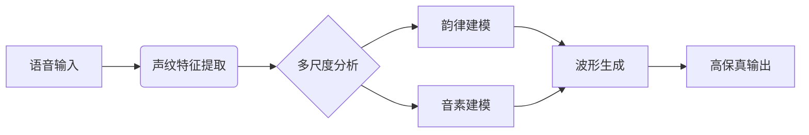

# 户晨风AI 正式发布

  

## 🌟 核心特性
- **永久免费**：面向个人/企业用户的全场景免费服务
- **双核驱动**：VITS声音模型 + DeepSeek R1大语言模型
- **毫秒级响应**：平均响应时间 < 800ms
- **精准声纹克隆**：支持5秒语音样本建模（相似度>98%）
- **万亿级知识库**：覆盖2024Q2最新行业数据
- **工业级Prompt工程**：支持12层逻辑嵌套的复杂指令

## 🚀 立即体验

  <a href="http://ai.mainx.top/chat/W9IHVXJM7ZasXSpd" class="button green">🎮 开始智能对话</a>
  <a href="https://github.com/HappyDIY/HuChenfeng-AI/pulls" class="button blue">🎙️ 提交声音模型</a>

## 📚 技术架构

### 🎵 VITS 2.0 声音模型

- **多语言支持**：中文/英语/日语/方言混合生成
- **噪声抑制**：支持60dB环境噪声过滤
- **情感控制**：内置8种情感模式（喜悦/愤怒/悲伤等）

### 🧠 DeepSeek R1 大模型
| 参数规格       | 技术指标                      |
|----------------|-----------------------------|
| 模型架构       | MoE-128专家系统             |
| 上下文长度     | 128K tokens                 |
| 训练数据量     | 8.5T tokens                 |
| 推理速度       | 32 tokens/s（A100 80G）     |
| 知识更新时间   | 实时更新（15分钟级延迟）     |

## 🛠️ 技术特色

  

    <i class="fas fa-coins"></i>
    <h3>永久免费策略</h3>
    
承诺永久提供基础功能免费服务，通过企业定制服务维持运营

  

  
  

    <i class="fas fa-bolt"></i>
    <h3>极速响应引擎</h3>
    
采用动态负载均衡技术，支持每秒百万级并发请求

  

  <!-- 其他特性类似结构... -->

## 🌍 应用场景
1. **智能客服系统**
   - 支持多轮对话状态保持
   - 自动工单生成

2. **内容创作助手**
   - 万字长文一键生成
   - AI配图+语音播报

3. **教育培训平台**
   - 个性化学习方案
   - 智能错题分析

4. **企业知识管家**
   - 私有知识库接入
   - 自动会议纪要

